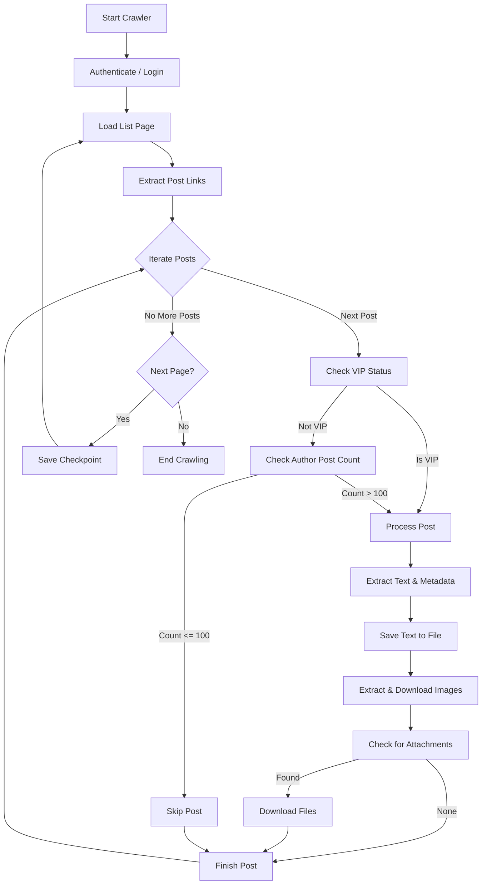
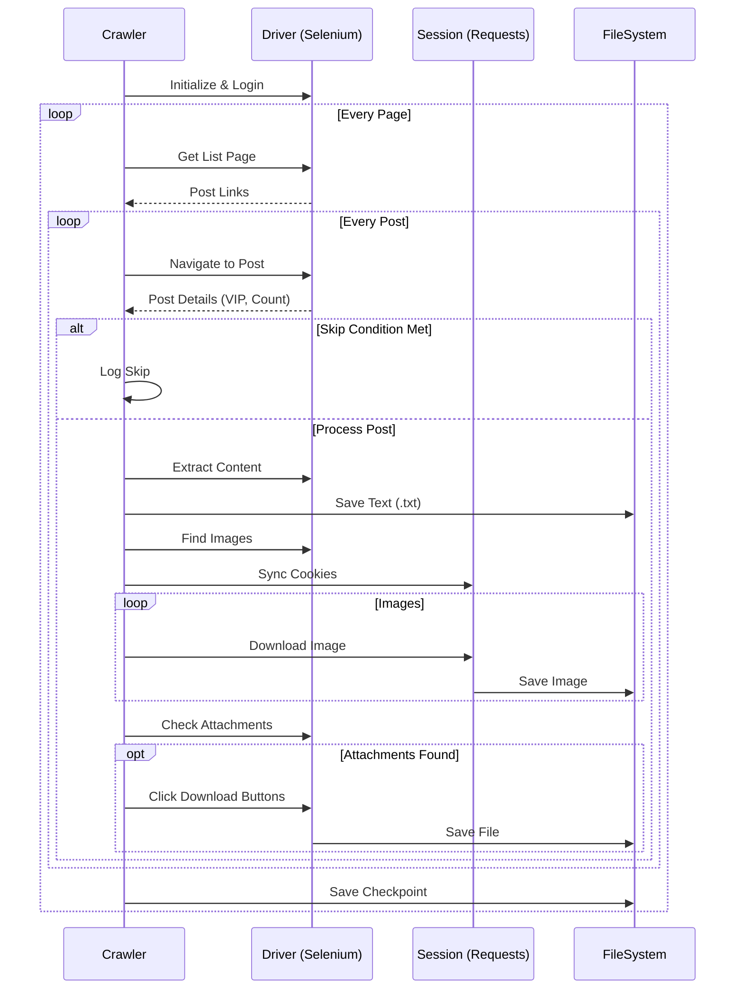
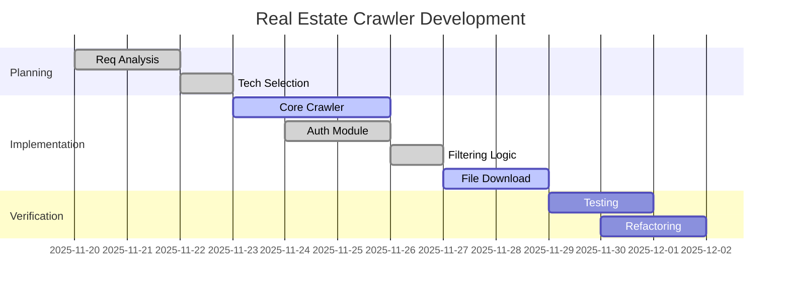
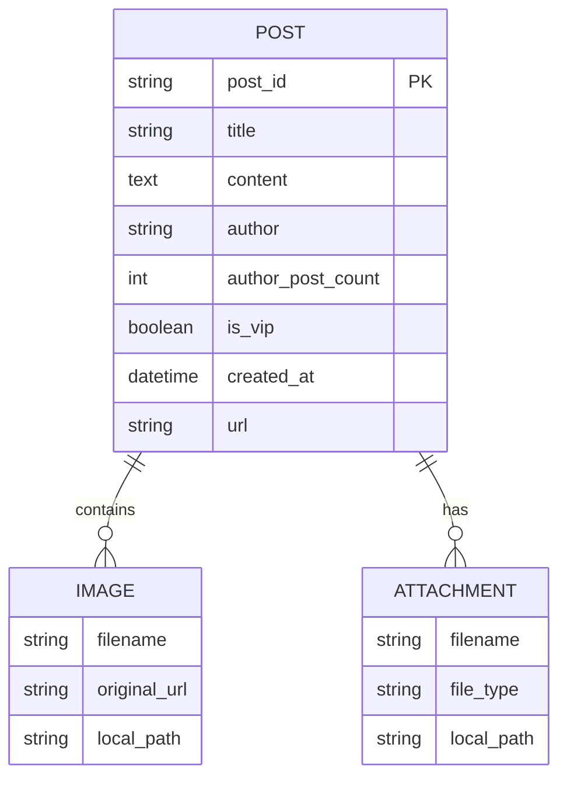
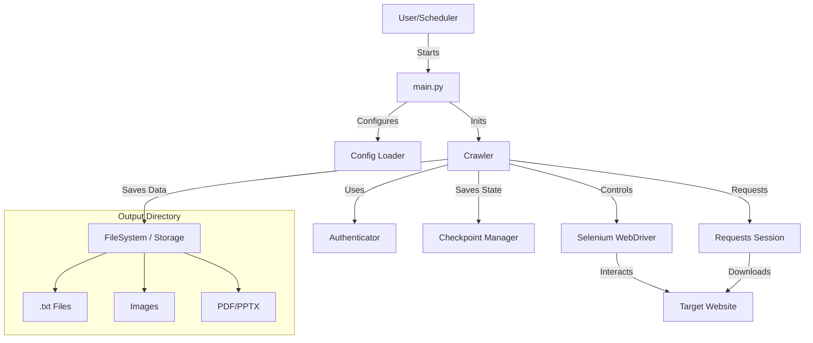

# Real Estate Community Crawler Service

[English](#english) | [한국어](#korean)

<a name="english"></a>
## English

### 1. Goal and Features

#### 1.1 Goal
- **Automated Data Collection**: Efficiently gather real estate insights from community posts.
- **High-Quality Data Filtering**: Prioritize content from experienced authors (VIPs or high post count).
- **Asset Archiving**: Automatically download and organize attached files (PDF, PPTX) and images.
- **Analysis Readiness**: Prepare data for downstream analysis (e.g., trend analysis, sentiment analysis).

#### 1.2 Features
- **Smart Filtering**: Skips posts from authors with ≤ 100 posts unless they are marked as 'VIP' (Creator/Ace).
- **Robust Authentication**: Handles login sessions, auto-reauthentication, and cookie synchronization between Selenium and Requests.
- **Content Extraction**: Captures title, content, author metadata, and creation dates.
- **Media & File Handling**: 
  - Downloads images embedded in posts.
  - Detects and downloads attachments (PDF, DOCX, PPTX, HWP, etc.).
- **Resilience**: 
  - Checkpoint system to resume from the last processed page.
  - Headless mode for server environments.
  - Anti-detection measures (User-Agent rotation, random delays).

#### 1.3 Team Composition
- **Maintainer**: Sanghyun
- **Contributors**: (Open for contribution)

### 2. Development Environment & URL

#### 2.1 Development Environment
- **Language**: Python 3.8+
- **Web Framework/Libraries**:
  - **Selenium 4.x**: For dynamic content rendering and interaction.
  - **Requests**: For efficient image/file downloading.
  - **BeautifulSoup4**: For HTML parsing.
  - **OpenCV & PaddleOCR**: For potential image processing/OCR tasks.
- **Infrastructure**:
  - System-installed Chromium & ChromeDriver (Snap) - Optimized for aarch64
  - Local File System for storage (`output/` directory)

#### 2.2 Target URL
- **Base URL**: `https://weolbu.com`
- **Community Path**: `/community`

### 3. Requirements & Logic Flow

#### 3.1 Crawling Logic
The crawler follows a systematic process to ensure data quality and stability.



#### 3.2 Sequence Diagram
Interaction between the Crawler, Browser (Selenium), and Storage.



### 4. Project Structure

```text
realEstateCrawler/
├── src/
│   ├── crawler/
│   │   ├── crawler.py       # Main crawler logic
│   │   ├── auth.py          # Authentication handler
│   │   └── download_detector.py # File detection logic
│   ├── storage/
│   │   ├── storage.py       # Storage interface
│   │   └── checkpoint_manager.py # Progress saving
│   ├── models/              # Data models
│   └── config.py            # Configuration settings
├── output/                  # Crawled data (Text, Images, Files)
├── requirements.txt         # Dependencies
├── main.py                  # Entry point
└── README.md                # This file
```

### 5. Development Schedule (WBS)



### 6. Data Modeling

Although this is a crawler, the data is structured logically for storage.



### 7. Architecture



### 8. Challenges & Solutions

- **Dynamic Content Loading**: 
  - *Challenge*: Some content and download buttons are loaded via JavaScript.
  - *Solution*: Used Selenium with explicit waits (`WebDriverWait`) to ensure elements are ready before interaction.

- **Session Management**:
  - *Challenge*: Keeping the session alive during long crawls and syncing between Selenium (for navigation) and Requests (for fast image downloading).
  - *Solution*: Implemented `_sync_cookies_to_session` to transfer cookies from the browser to the requests session, and added auto-reauthentication logic when the "Login Required" modal appears.

- **Anti-Bot Detection**:
  - *Challenge*: Frequent requests might trigger blocking.
  - *Solution*: Added random delays, User-Agent rotation, and `tqdm` for monitoring progress without aggressive polling.

- **File Downloads**:
  - *Challenge*: Browser download dialogs block automation.
  - *Solution*: Configured Chrome Options to auto-download to specific directories and disabled popups.

---

<a name="korean"></a>
## Korean (한국어)

### 1. 목표 및 기능

#### 1.1 목표
- **자동화된 데이터 수집**: 커뮤니티 게시글에서 부동산 관련 인사이트를 효율적으로 수집합니다.
- **고품질 데이터 필터링**: 경험 많은 작성자(VIP 또는 게시글 수 많은 유저)의 콘텐츠를 우선순위로 둡니다.
- **자산 아카이빙**: 첨부 파일(PDF, PPTX) 및 이미지를 자동으로 다운로드하고 정리합니다.
- **분석 준비**: 추후 분석(예: 트렌드 분석, 감성 분석)을 위해 데이터를 준비합니다.

#### 1.2 기능
- **스마트 필터링**: 작성자의 게시글 수가 100개 이하인 경우, 'VIP'(크리에이터/에이스) 등급이 아니면 건너뜁니다.
- **강력한 인증**: 로그인 세션 관리, 자동 재인증, Selenium과 Requests 간의 쿠키 동기화를 처리합니다.
- **콘텐츠 추출**: 제목, 본문, 작성자 메타데이터, 작성일시를 수집합니다.
- **미디어 및 파일 처리**:
  - 게시글에 포함된 이미지를 다운로드합니다.
  - 첨부 파일(PDF, DOCX, PPTX, HWP 등)을 감지하고 다운로드합니다.
- **안정성**:
  - 마지막으로 처리한 페이지부터 재개할 수 있는 체크포인트 시스템.
  - 서버 환경을 위한 헤드리스(Headless) 모드 지원.
  - 탐지 방지 조치(User-Agent 로테이션, 랜덤 지연).

#### 1.3 팀 구성
- **메인테이너**: Sanghyun
- **기여자**: (기여 환영)

### 2. 개발 환경 및 배포 URL

#### 2.1 개발 환경
- **언어**: Python 3.8+
- **웹 프레임워크/라이브러리**:
  - **Selenium 4.x**: 동적 콘텐츠 렌더링 및 상호작용.
  - **Requests**: 효율적인 이미지/파일 다운로드.
  - **BeautifulSoup4**: HTML 파싱.
  - **OpenCV & PaddleOCR**: 이미지 처리/OCR 작업(필요 시).
- **인프라**:
  - 시스템 설치 Chromium & ChromeDriver (Snap) - aarch64 최적화
  - 로컬 파일 시스템 스토리지 (`output/` 디렉토리)

#### 2.2 타겟 URL
- **기본 URL**: `https://weolbu.com`
- **커뮤니티 경로**: `/community`

### 3. 요구사항 및 로직 흐름

#### 3.1 크롤링 로직
크롤러는 데이터 품질과 안정성을 보장하기 위해 체계적인 프로세스를 따릅니다.

(상단 영문 섹션의 3.1 Flowchart 참조)

#### 3.2 시퀀스 다이어그램
크롤러, 브라우저(Selenium), 스토리지 간의 상호작용입니다.

(상단 영문 섹션의 3.2 Sequence Diagram 참조)

### 4. 프로젝트 구조

(상단 영문 섹션의 4. Project Structure 참조)

### 5. 개발 일정 (WBS)

(상단 영문 섹션의 5. Development Schedule 참조)

### 6. 데이터 모델링

크롤러이지만, 저장되는 데이터는 논리적으로 구조화되어 있습니다.

(상단 영문 섹션의 6. Data Modeling 참조)

### 7. 아키텍처

(상단 영문 섹션의 7. Architecture 참조)

### 8. 문제 해결 (Challenges & Solutions)

- **동적 콘텐츠 로딩**:
  - *문제*: 일부 콘텐츠와 다운로드 버튼이 JavaScript를 통해 로드됨.
  - *해결*: Selenium의 명시적 대기(`WebDriverWait`)를 사용하여 요소가 준비될 때까지 기다린 후 상호작용.

- **세션 관리**:
  - *문제*: 긴 크롤링 시간 동안 세션을 유지하고, (탐색을 위한) Selenium과 (빠른 이미지 다운로드를 위한) Requests 간의 세션 동기화 필요.
  - *해결*: `_sync_cookies_to_session`을 구현하여 브라우저 쿠키를 Requests 세션으로 전송하고, "로그인 필요" 모달이 뜰 경우 자동 재인증 로직 추가.

- **봇 탐지 방지**:
  - *문제*: 빈번한 요청으로 인한 차단 가능성.
  - *해결*: 랜덤 지연(Random Delay), User-Agent 로테이션, `tqdm`을 사용한 진행 상황 모니터링 적용.

- **파일 다운로드**:
  - *문제*: 브라우저의 다운로드 대화상자가 자동화를 차단함.
  - *해결*: Chrome Options를 설정하여 특정 디렉토리로 자동 다운로드되도록 하고 팝업을 비활성화.
